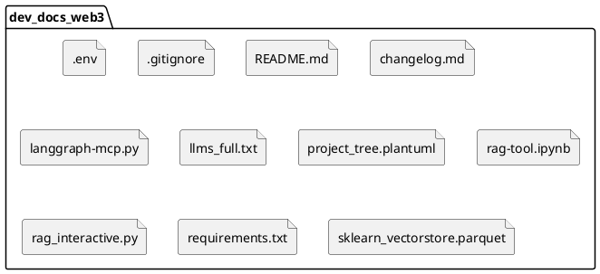

# dev_docs_web3

Проект для работы с RAG (Retrieval-Augmented Generation) и документацией по Web3.

## Назначение

Цель этого проекта — создать систему, которая может эффективно извлекать информацию из обширной документации по Web3 и генерировать на ее основе точные и контекстуально релевантные ответы. Это достигается путем объединения возможностей больших языковых моделей (LLM) с механизмами поиска и извлечения информации (RAG).

## Установка

Для установки и запуска проекта выполните следующие шаги:

1. Клонируйте репозиторий:

   ```bash
   git clone https://github.com/syntaxerror64/dev_docs_web3_new.git
   cd dev_docs_web3_new
   ```

2. Создайте виртуальное окружение и активируйте его:

   ```bash
   python -m venv venv
   # Для Windows
   .\venv\Scripts\activate
   # Для macOS/Linux
   source venv/bin/activate
   ```

3. Установите необходимые зависимости:

   ```bash
   pip install -r requirements.txt
   ```

4. Создайте файл `.env` в корневой директории проекта и добавьте необходимые переменные окружения (например, ключи API для LLM).

   ```
   # Пример содержимого .env
   OPENAI_API_KEY="your_openai_api_key"
   ```

## Использование

После установки вы можете использовать проект для:

- **Обработки документации:** Загружайте и индексируйте документацию по Web3 для создания базы знаний.
- **Генерации ответов:** Задавайте вопросы системе и получайте ответы, основанные на извлеченной информации.
- **Интерактивного взаимодействия:** Используйте `rag_interactive.py` для интерактивного режима.

### Примеры запуска

- Запуск интерактивного режима:

  ```bash
  python rag_interactive.py
  ```

- Запуск Jupyter Notebook для экспериментов:

  ```bash
  jupyter notebook rag-tool.ipynb
  ```

## Структура проекта



## Changelog

Смотрите файл `changelog.md` для истории изменений.

## Лицензия

Этот проект распространяется под лицензией MIT. Подробности смотрите в файле `LICENSE` (если применимо).
